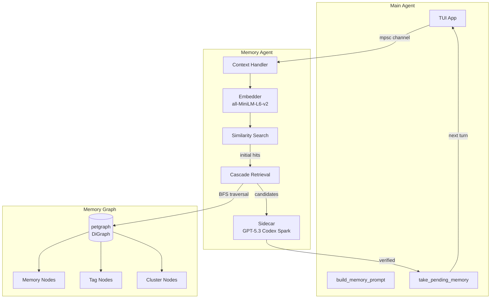

=== SWARM_ARCHITECTURE.md ===
# Swarm Architecture (Proposed)

Status: Proposed

This document captures the intended swarm coordination design based on the current
project direction. It describes how agents coordinate, plan, communicate, and
integrate work with optional git worktrees.

## Goals

- Parallel work across many agents without locks.
- A comprehensive initial plan, but allowed to evolve as work progresses.
- Plan distribution is out-of-band (not stored in the repo).
- Swarm runtime state survives reloads and crash recovery via daemon snapshots.
- Explicit coordination via broadcast updates, DMs, and channels.
- Optional git worktrees used only when they make sense.
- Integration handled by worktree managers, not the coordinator.

## Roles

### Coordinator

- Creates the initial, comprehensive plan.
- Spawns all subagents and assigns scopes.
- Can shut down agents and spawn replacements as needed.
- Is the only role allowed to spawn or stop agents.
- Decides if a git worktree is needed and groups agents per worktree.
- Reviews plan update proposals and broadcasts approved updates.
- Can issue plan updates directly when it discovers a plan issue.
- Does not perform merges or integration.

### Worktree Manager

- Owns a single worktree scope.
- Knows the full plan and the worktree scope.
- Coordinates work inside that worktree.
- Responsible for integration when that worktree scope is done.

### Agents

- Execute tasks in parallel.
- Receive the full plan plus their scoped instructions on spawn.
- Propose plan updates when they discover issues or new requirements.
- Coordinate directly with other agents via DM or channels.
- Emit lifecycle events when they start, finish, or stop unexpectedly.
- Cannot spawn or shut down other agents (including agents spawned by non-coordinator agents).

## Agent Lifecycle States

- spawned: session created, not yet ready.
- ready: plan and scope received, waiting for work.
- running: actively executing a task or tool.
- blocked: cannot proceed (dependency, conflict, or missing info).
- completed: assigned scope done, waiting for new assignment.
- failed: unrecoverable error, needs coordinator decision.
- stopped: intentionally shut down by coordinator.
- crashed: unexpected exit (no clean shutdown).

## Agent Lifecycle Notifications

- Each agent emits a completion event when its assigned scope is done.
- Each agent emits a stop event when it cannot continue or exits unexpectedly.
- The coordinator receives these events and decides next steps (respawn, rescope,
  shutdown, or mark complete).
- Lifecycle updates drive the swarm info widget status indicators.

## Completion Report Policy

- Spawned or assigned agents owned by a coordinator (`report_back_to_session_id`) must
  finish each prompted work turn with a useful final assistant response. The server
  automatically forwards that final response to the owning coordinator as the
  completion report.
- A completion report should include outcome/status, changes or findings, validation
  performed, and blockers or follow-ups. It should not be just `done`, a lifecycle
  status change, or a tool transcript.
- Reports are required for spawn prompts, assigned plan tasks, and explicit
  start/wake/resume/retry task-control runs. If a worker fails before producing a
  final response, the coordinator still receives the failure lifecycle notification.
- Reports are not required for idle spawn-without-prompt sessions, user-created peers
  that have no report-back owner, ordinary status broadcasts while work is still

=== MEMORY_ARCHITECTURE.md ===
# Memory Architecture Design

> **Status:** Implemented (Core), Planned (Graph-Based Hybrid)
> **Updated:** 2026-01-27

Local embeddings + lightweight sidecar (GPT-5.3 Codex Spark) are implemented and running in production. This document describes both the current implementation and the planned graph-based hybrid architecture.

## Overview

See also: [Memory Regression Budget](./MEMORY_BUDGET.md) for the current measurable guardrails and review expectations.

A multi-layered memory system for cross-session learning that mimics how human memory works - relevant memories "pop up" when triggered by context rather than requiring explicit recall.

**Key Design Decisions:**
1. **Fully async and non-blocking** - The main agent never waits for memory; results from turn N are available at turn N+1
2. **Graph-based organization** - Memories form a connected graph with tags, clusters, and semantic links
3. **Cascade retrieval** - Embedding hits trigger BFS traversal to find related memories
4. **Hybrid grouping** - Combines explicit tags, automatic clusters, and semantic links

---

## Architecture Overview



---

## Graph-Based Data Model

### Node Types

```mermaid
graph LR
    subgraph "Node Types"
        M((Memory))
        T[Tag]
        C{Cluster}
    end

    M -->|HasTag| T
    M -->|InCluster| C
    M -.->|RelatesTo| M
    M ==>|Supersedes| M
    M -.->|Contradicts| M

    style M fill:#e1f5fe

=== AMBIENT_MODE.md ===
# Ambient Mode

> **Status:** Design
> **Updated:** 2026-02-08

A proactive, always-on agent mode that works autonomously without user prompting. Like a brain consolidating memories during sleep, ambient mode tends to the memory graph, identifies useful work, and acts on the user's behalf — all while staying within resource limits.

## Overview

Ambient mode operates as a background loop that:
1. **Gardens** — consolidates, prunes, and strengthens the memory graph
2. **Scouts** — analyzes recent sessions, git history, and memories to understand what the user cares about
3. **Works** — proactively completes tasks the user would appreciate being surprised by

These aren't separate phases. The agent does all three in a single pass — while looking at memories it naturally discovers maintenance work and identifies proactive opportunities simultaneously.

**Key Design Decisions:**
1. **Single agent at a time** — only one ambient instance ever runs, no parallelism
2. **Subscription-first** — defaults to OAuth (OpenAI/Anthropic), never uses API keys unless explicitly configured
3. **User priority** — interactive sessions always take precedence over ambient work
4. **Strong models** — uses the strongest available model from the selected provider so the agent can reason well about what's actually useful
5. **Self-scheduling** — the agent decides when to wake next, constrained by adaptive resource limits

---

## Architecture

```mermaid
graph TB
    subgraph "Scheduling Layer"
        EV[Event Triggers<br/>session close, crash, git push]
        TM[Timer<br/>agent-scheduled wake]
        RC[Resource Calculator<br/>adaptive interval]
        SQ[(Scheduled Queue<br/>persistent)]
    end

    subgraph "Ambient Agent"
        QC[Check Queue]
        SC[Scout<br/>memories + sessions + git]
        GD[Garden<br/>consolidate + prune + verify]
        WK[Work<br/>proactive tasks]
        SA[schedule_ambient tool<br/>set next wake + context]
    end

    subgraph "Resource Awareness"
        UH[Usage History<br/>rolling window]
        RL[Rate Limits<br/>per provider]
        AU[Ambient Usage<br/>current window]
        AC[Active Sessions<br/>user activity]
    end

    subgraph "Outputs"
        MG[(Memory Graph<br/>consolidated)]
        CM[Commits & Changes]
        IW[Info Widget<br/>TUI display]
    end

    EV -->|wake early| RC
    TM -->|scheduled wake| RC
    RC -->|"gate: safe to run?"| QC
    SQ -->|pending items| QC
    QC --> SC
    SC --> GD
    SC --> WK
    GD --> MG
    WK --> CM
    SA -->|next wake + context| SQ
    SA -->|proposed interval| RC

    UH --> RC
    RL --> RC
    AU --> RC
    AC --> RC

    QC --> IW
    SC --> IW
    GD --> IW
    WK --> IW

    style EV fill:#fff3e0

=== SAFETY_SYSTEM.md ===
# Safety System

> **Status:** Design
> **Updated:** 2026-02-08

A human-in-the-loop safety layer for unmonitored agent operations. Designed as an independent subsystem that any jcode feature can integrate with. Currently the only consumer is ambient mode, but the system is intentionally decoupled so it can be reused for future features.

## Overview

When an agent operates without direct user supervision (e.g. ambient mode), it needs a way to:
1. **Know what it's allowed to do** without asking
2. **Request permission** for actions that require human approval
3. **Notify the user** that a request is pending
4. **Wait or move on** while the user reviews
5. **Report what it did** after each session

The safety system provides all of this. There are only two tiers: auto-allowed and requires-permission. There is no "always denied" — if the user explicitly approves something, the agent can do it. The core principle is that **anything that communicates with another human or leaves a trace outside the local sandbox requires permission.**

---

## Architecture

```mermaid
graph TB
    subgraph "Agent (e.g. Ambient Mode)"
        A[Agent wants to take action]
        AC{Action classification}
        AUTO[Auto-allowed<br/>execute immediately]
        PERM[Requires permission<br/>call request_permission tool]
    end

    subgraph "Safety System"
        RQ[(Review Queue<br/>persistent)]
        CL[Action Classifier]
        NF[Notification Dispatcher]
        TL[Transcript Logger]
        SR[Session Reporter]
    end

    subgraph "Notification Channels"
        EM[Email]
        SM[SMS / Text]
        DN[Desktop Notification]
        WH[Webhook]
        TUI[TUI Widget]
    end

    subgraph "User Review"
        PH[Phone / Email]
        CLI[jcode safety review]
        TW[TUI Review Panel]
    end

    A --> CL
    CL --> AC
    AC -->|safe| AUTO
    AC -->|needs review| PERM

    PERM --> RQ
    RQ --> NF
    NF --> EM
    NF --> SM
    NF --> DN
    NF --> WH
    NF --> TUI

    PH -->|approve/deny| RQ
    CLI -->|approve/deny| RQ
    TW -->|approve/deny| RQ
    RQ -->|decision| A

    AUTO --> TL
    PERM --> TL
    TL --> SR

    style AUTO fill:#e8f5e9
    style PERM fill:#fff3e0
    style RQ fill:#e3f2fd
```


=== MODULAR_ARCHITECTURE_RFC.md ===
# Modular Architecture RFC

Status: Draft

This RFC describes a modular target architecture for jcode that matches the current codebase, preserves the existing product model, and gives us a safe migration path from today's mostly-monolithic root crate to a layered workspace.

It is intentionally aligned with:

- [`REFACTORING.md`](./REFACTORING.md)
- [`COMPILE_PERFORMANCE_PLAN.md`](./COMPILE_PERFORMANCE_PLAN.md)
- [`SERVER_ARCHITECTURE.md`](./SERVER_ARCHITECTURE.md)
- [`MULTI_SESSION_CLIENT_ARCHITECTURE.md`](./MULTI_SESSION_CLIENT_ARCHITECTURE.md)

## Goals

- Document the architecture that exists today, not an idealized version.
- Define a target layered and crate architecture that improves maintainability and compile times.
- Establish dependency rules that prevent the workspace from collapsing back into a monolith.
- Provide a phased migration plan that fits the refactoring roadmap and compile-performance plan.
- Preserve runtime behavior: one shared server, reconnecting clients, session-local self-dev capability, and stable tool/provider flows.

## Non-Goals

- A big-bang rewrite.
- Renaming every module or crate immediately.
- Forcing every subsystem into a separate crate before its boundaries are ready.
- Changing the core product architecture from single-server, multi-client.

## Executive Summary

Today, jcode is best described as a **modular monolith with a growing workspace shell**:

- The root `jcode` crate still owns most runtime orchestration and product behavior.
- Several heavy or relatively self-contained subsystems have already moved into workspace crates.
- The codebase has strong module-level separation in some areas, but several broad root modules still act as architectural chokepoints.

The target architecture is a **layered workspace**:

1. **Foundation layer** for stable shared types and runtime primitives.
2. **Domain/runtime layer** for session, agent, provider, and server logic.
3. **Interface layer** for CLI, TUI, self-dev, and optional heavy integrations.
4. **Composition layer** where the top-level `jcode` package wires the product together.

The most important design rule is this:

> High-churn orchestration code must depend on stable lower layers, while stable lower layers must never depend back on runtime/UI/product-specific code.

That rule serves both architecture quality and compile-speed goals.

## Current Architecture

### Current runtime model

At the product level, the runtime architecture is already clear:

- `jcode` is a **single-server, multi-client** application.
- The server owns sessions, swarm state, background tasks, provider state, and shared services.
- Clients are primarily TUI frontends that attach to server-owned sessions.
- Self-dev is session-local capability on the shared server, not a separate architecture.

That model should stay intact.

### Current code organization

The current code organization is mixed:

- **Root crate `jcode`** still contains most product logic.
- **Workspace crates** already isolate several heavy or stable seams.
- **Subdirectories under `src/`** increasingly reflect domain boundaries, especially for `agent`, `cli`, `server`, `tool`, and `tui`.

Current workspace members from `Cargo.toml`:

- root package: `jcode`
- `crates/jcode-agent-runtime`
- `crates/jcode-embedding`
- `crates/jcode-pdf`
- `crates/jcode-azure-auth`
- `crates/jcode-notify-email`
- `crates/jcode-provider-metadata`
- `crates/jcode-provider-core`

=== CRATE_OWNERSHIP_BOUNDARIES.md ===
# Crate Ownership and Modularization Boundaries

This document defines the target structure for keeping `jcode` modular without turning shared crates into a dumping ground. It is intentionally practical: use it when deciding whether to move a type, helper, or behavior out of the root crate.

## Goals

Primary goal: make normal development and selfdev builds faster by shrinking the root crate's recompilation surface. Structural cleanliness is valuable because it supports that compile-time goal.

- Move stable DTOs and protocol-safe state into small crates so changes in root behavior do not recompile those contracts, and changes in contracts recompile only focused dependents.
- Keep dependency-light crates dependency-light so they compile quickly and do not pull large runtime/TUI/provider graphs into unrelated builds.
- Keep root-only behavior, storage, process, TUI, server, and provider runtime logic in the root crate until a full dependency boundary can move without increasing dependency fan-out.
- Avoid cyclic dependencies and hidden coupling through broad `jcode-core` re-exports.
- Preserve serde compatibility and root re-exports during migrations unless all call sites are intentionally updated.
- Measure success by compile impact: fewer root edits, fewer root-owned DTOs, smaller dependency fan-out, and faster `cargo check --profile selfdev` / `selfdev build` after common changes.

## Ownership rules

### Type crates own stable data contracts

A `*-types` crate should contain:

- Plain data structures used by multiple crates or protocol layers.
- Serialization shape and small pure helper methods tied to the data contract.
- No filesystem, network, process, TUI, provider client, global state, or storage access.
- Dependencies limited to serde, chrono, and other type crates where necessary.

Examples: `jcode-session-types`, `jcode-side-panel-types`, `jcode-selfdev-types`, `jcode-background-types`.

### Domain behavior modules own root runtime behavior

Root modules should keep behavior when it needs:

- `crate::storage`, `crate::config`, `crate::logging`, `crate::server`, or process spawning.
- Provider HTTP clients and auth managers.
- Tokio runtime, background tasks, channels, global caches, file locks, or PID registries.
- TUI rendering and crossterm/ratatui state.

If a type has inherent methods that need these APIs, either leave the type in root or move behavior and dependencies together into a domain crate. Do not move only the struct if that forces illegal inherent impls in root.

### `jcode-core` is for genuinely shared primitives

`jcode-core` should contain:

- Cross-domain primitives that do not have an obvious domain crate yet.
- Very small, dependency-light helpers used by many crates.
- Temporary DTO staging only when creating a new domain type crate would be premature.

`jcode-core` should not accumulate every extracted DTO indefinitely. Once a cluster grows, split it into a focused domain crate.

### Compile-speed decision rule

Prefer a split when it reduces root crate churn or dependency fan-out. Do not split just to make files look tidier if the new crate adds dependencies, increases rebuild fan-out, or forces frequent cross-crate edits. A good split has at least one of these compile-time benefits:

- Common root behavior edits no longer touch stable type definitions.
- A type-only change can be checked by compiling a small type crate plus focused dependents.
- Heavy dependencies stay out of DTO crates.
- Multiple downstream crates can use a small contract without depending on the root crate.

### Re-export policy

During migrations:

1. Move the type to the target crate.
2. Keep the old root path as `pub use ...` to preserve call sites.
3. Validate focused tests and selfdev build/reload.
4. Later, remove obsolete root re-exports only after downstream crates can depend directly on the domain crate.

## Move checklist

Use this checklist for every type or pure-helper migration. Copy it into the PR/commit notes when a move is non-trivial.

1. Classify the candidate.
   - [ ] Is it a stable data contract or pure helper rather than root runtime behavior?
   - [ ] Does it have inherent methods?
   - [ ] Do those methods require root-only APIs such as storage, network clients, TUI state, process management, or globals?
   - [ ] If behavior must move too, can the full dependency boundary move without increasing fan-out?
2. Check compatibility.
   - [ ] Does its serde representation stay identical?
   - [ ] Are defaults, skips, renames, and enum discriminants preserved?
   - [ ] Are all field visibilities still appropriate?

